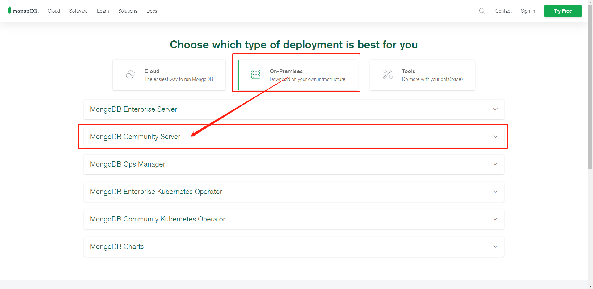
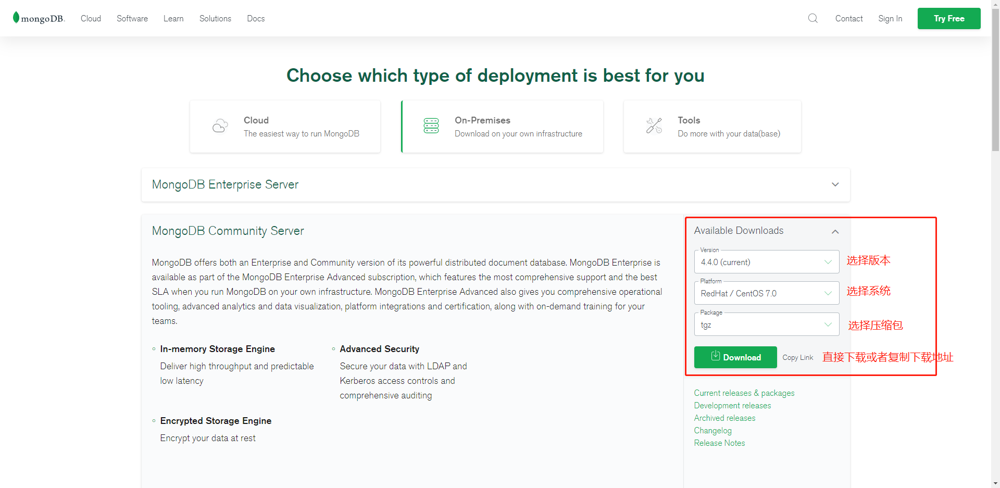

## 获取下载地址
- MongoDB 源码下载地址：https://www.mongodb.com/download-center#community





## 下载

> 这里我们选择 tgz 下载，下载完安装包，并解压 tgz（以下演示的是 64 位 Linux上的安装） 。

```sh
[root@localhost ~]# wget https://fastdl.mongodb.org/linux/mongodb-linux-x86_64-rhel70-4.4.0.tgz        # 下载
[root@localhost ~]# tar -zxvf mongodb-linux-x86_64-rhel70-4.4.0.tgz                                    # 解压
[root@localhost ~]# mv mongodb-src-r4.2.8  /usr/local/mongodb4                                         # 将解压包拷贝到指定目录
```

> MongoDB 的可执行文件位于 bin 目录下，所以可以将其添加到 PATH 路径中：

```sh
[root@localhost ~]# vim /etc/profile                    # 编辑该文件将MongoDB的可执行文件所在的bin目录添加进环境变量
[root@localhost ~]# 
```

**export PATH=<mongodb-install-directory>/bin:$PATH**

> <mongodb-install-directory> 为你 MongoDB 的安装路径。如本文的 /usr/local/mongodb4 。

```sh
PATH=${PATH}:/usr/local/mongodb4/bin
export PATH
```

```sh
[root@localhost ~]# source /etc/profile                 # 使文件生效
[root@localhost ~]# 
```

## 创建数据库目录

**默认情况下 MongoDB 启动后会初始化以下两个目录：**
- 数据存储目录：/var/lib/mongodb
- 日志文件目录：/var/log/mongodb

**我们在启动前可以先创建这两个目录并设置当前用户有读写权限：**

```sh
sudo mkdir -p /var/lib/mongo
sudo mkdir -p /var/log/mongodb
sudo chown `whoami` /var/lib/mongo     # 设置权限
sudo chown `whoami` /var/log/mongodb   # 设置权限
```

**接下来启动 Mongodb 服务：**

> 下面是附加了一些参数进行启动的，数据库路径和日志路径，以及绑定所有ip都可以连接

```sh
[root@localhost ~]# mongod --dbpath /var/lib/mongo --logpath /var/log/mongodb/mongod.log --bind_ip_all --fork
about to fork child process, waiting until server is ready for connections.
forked process: 1365
child process started successfully, parent exiting
[root@localhost ~]# 
```